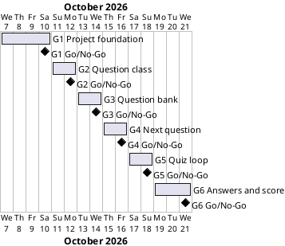

# Project Plan: Quiz Game

## Metadata
| Key | Value |
| --- | --- |
| ID | PP-001 |
| CrossReference | [BC-001], [SA-001], [MIL-001], [MIL-002], [MIL-003], [MIL-004], [MIL-005], [MIL-006] |
| Language | en |
| Domain | it |

## Version History
| Date | Status | Author | Reviewer | Change | Commit |
| --- | --- | --- | --- | --- | --- |
| 2026-10-07 | Accepted | Jens Tirsvad Nielsen | S01 | Initial version | [ab361ed] |

---

## Purpose

The plan schedules the six gateways that take the day 17 quiz assignment from the course's starter files to a tested, documented and shareable repository: one foundation gateway and one gateway for each of the five lecture parts. It schedules them against the Business Case's self-set target of finishing by 2026-10-21 ([BC-001], Assumptions). Each gateway is delivered on its own branch and pull request, so the plan is also the list of steps S01 reviews.

## Planning Assumptions

- Week 1 starts 2026-10-07; the plan ends by 2026-10-21, a target S01 set for the Business Case; there is no external deadline.
- Phase length: two to four days per gateway, shortest for the lecture parts, which are a few lines of code each.
- S01 is owner and approving reviewer of every gateway ([SA-001]); S01 decides Go or No-Go on the decision date.
- A gateway's branch is named after its document (`mil-001-project-foundation`, `mil-002-question-class`, and so on); one pull request per gateway; its description closes the gateway's issues with one `Closes #N` line each.
- Work under `src/` and `tests/` starts for a gateway only when its milestone document is `Accepted` with a `Go` review record (plan-first gate). Reviews of the planning documents come first.
- Nothing is committed or pushed until S01 asks.

## Gateway Schedule

| Gateway | Document | Window | Decision date | Owner | Stories | Main deliverable | Milestone |
| --- | --- | --- | --- | --- | --- | --- | --- |
| G1 Project foundation | [MIL-001] | 2026-10-07 to 2026-10-10 | 2026-10-10 | S01 | — | Starter files in `src/`, `pyproject.toml`, `.gitignore`, `constants.py`, `Doxyfile`, README, continuous-integration (CI) workflow, repository description and topics | |
| G2 Question class | [MIL-002] | 2026-10-11 to 2026-10-12 | 2026-10-12 | S01 | — | `Question` class with `text` and `answer`, and its tests | |
| G3 Question bank | [MIL-003] | 2026-10-13 to 2026-10-14 | 2026-10-14 | S01 | — | The `question_bank` of 12 `Question` objects built from `question_data` | |
| G4 Next question | [MIL-004] | 2026-10-15 to 2026-10-16 | 2026-10-16 | S01 | — | `QuizBrain` with `question_number`, `question_list` and `next_question` | |
| G5 Quiz loop | [MIL-005] | 2026-10-17 to 2026-10-18 | 2026-10-18 | S01 | — | `still_has_questions` and the `while` loop that asks every question | |
| G6 Answers and score | [MIL-006] | 2026-10-19 to 2026-10-21 | 2026-10-21 | S01 | — | `check_answer`, the running score, the final score, final README check | |



## Scope Coverage

| Business Case scope item | Gateway |
| --- | --- |
| Starter files copied into `src/` | G1 |
| `constants.py`, `pyproject.toml`, `.gitignore`, `Doxyfile`, Doxygen comments, README, `.venv` instructions, CI workflow | G1 (Doxygen comments in every gateway that adds code) |
| Repository description and topics | G1 |
| `Question` class | G2 |
| Question bank built from `question_data` | G3 |
| `QuizBrain` class and `next_question` | G4 |
| `still_has_questions` and the question loop in `main.py` | G5 |
| `check_answer`, the score and the final result | G6 |
| Tests under `tests/` | G1 (starter data test), then each gateway tests its own code |

## Dependencies

```
G1 Project foundation → G2 Question class → G3 Question bank → G4 Next question → G5 Quiz loop → G6 Answers and score
```

A No-Go on a gateway stops the chain: the later gateways start from the code the earlier one merged, so each later decision date moves by the rework time of the gateway before it. The 2026-10-21 target then slips; it is not defended by dropping a review.

## Plan Risks

| Risk | Impact | Mitigation |
| --- | --- | --- |
| Reviews of the planning documents (Business Case, Stakeholder Analysis, Project Plan, six milestones) take longer than the first gateway window | G1 cannot start on 2026-10-07 and every date moves | The dates are targets, not commitments; the decision dates move together as a block |
| Each gateway is small, so review effort dominates | Calendar time is spent on review records rather than code | One `QC-MIL-001` review per milestone document, one `QC-PY-001` review per pull request; both record short, specific evidence |
| The Doxygen and CI set-up in G1 grows larger than planned | G1 overruns and delays G2 to G6 | G1 has a fixed task list; extras go to a new gateway |
| The target repository for the description and topics is unclear (see Open Issues) | G1 task 9 is blocked | Confirm the repository before the task starts |

## Open Issues

- **Python version:** "greater than 3.13" is read as 3.13 or newer (`requires-python = ">=3.13"`). S01 to confirm; if 3.14 or newer is meant, the setting and the CI version change.
- **Repository for description and topics:** the request names `https://git.tirsystem.com/Tirsvad-Udemy-100_days_of_code` (underscores), while `origin` is `Tirsvad-Udemy-100-days-of-code/017-quiz-game-start` (hyphens) and a GitHub remote `github` also exists. S01 to confirm which repository or repositories receive the description and topics.
- **Starter folder:** `quiz-game-start/` is kept after the copy to `src/` (assumption in [BC-001]). S01 to say whether it is removed once G1 is merged.
- **README template:** the README follows the Product Owner's template (Requirements, Set up, Run, Run the tests, Continuous integration, Build the source documentation, Project layout, License), which differs from `framework/templates/README-template.md`. `framework/scripts/check-readme.sh` would report that if S01 switches it on.
- **Continuous integration host:** the workflow is stored in `.github/workflows/` (read by GitHub and by Gitea Actions). Whether the Gitea instance has a runner is not known.
- **Use cases and user stories:** none are created. All tasks are technical tasks taken from the lecture summaries, which already fix the behaviour; the only actor is the player. S01 to confirm, or ask for a story such as "Player answers the quiz".
- **Design record:** no Design Class Diagram or ADR is created; the two classes are fixed by the lectures. The flat `src/` layout (not the layered layout in the framework's optional Python agent rules) and the helper functions `build_question_bank()` and `main()` (added so tests can import `main.py` without running the quiz) are decisions for S01 to confirm; `QC-PY-001` criterion 10 is then recorded as not applicable.
- **Console output:** `print` and `input` are the program's user interface; `QC-PY-001` criterion 9 (logging instead of `print`) is recorded as not applicable to them.
- **Classification of S02 and S03:** proposed by the analyst in [SA-001]; S01 to confirm.
- **Reviewer independence:** the framework requires that a reviewer is not the author. The documents were drafted by an AI assistant and reviewed by S01, the only stakeholder who can review; the project has no governance document (`GOV`), so the rule cannot be checked further. S01 to decide whether a `GOV` document is needed.
- **Review records:** `RC-001` to `RC-009` and the traceability matrix have no QC checklist, so no review gate applies to them; they stay `Proposed`.
- **Diagram check:** the Gantt chart above has not been rendered; no PlantUML server was set.

---

[BC-001]: ./business-case.md
[SA-001]: ./stakeholder-analysis.md
[MIL-001]: ./milestones/mil-001-project-foundation.md
[MIL-002]: ./milestones/mil-002-question-class.md
[MIL-003]: ./milestones/mil-003-question-bank.md
[MIL-004]: ./milestones/mil-004-next-question.md
[MIL-005]: ./milestones/mil-005-quiz-loop.md
[MIL-006]: ./milestones/mil-006-answers-and-score.md
[ab361ed]: https://git.tirsystem.com/Tirsvad-Udemy-100-days-of-code/017-quiz-game-start/commit/ab361edf622585f77249d7782a9e2619f7d85cfc
